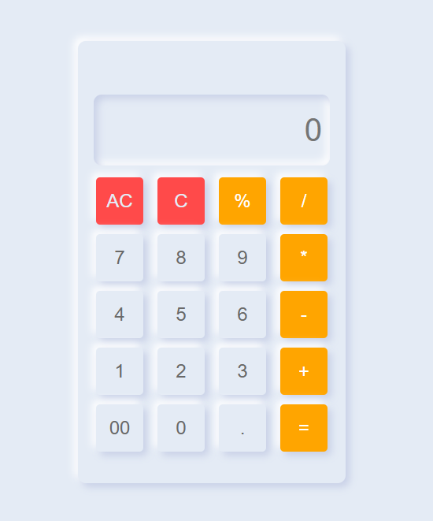

# 🧮 Neumorphism Calculator

This is a simple calculator built using HTML, CSS, and JavaScript.  
The design is clean and user-friendly, featuring basic arithmetic operations.



## ✨ Features

- Basic operations: addition, subtraction, multiplication, division, modulus
- Clear entry and all-clear buttons (C and AC)
- Neumorphic UI
- Displays current expression and the last calculated answer

## 💻 Technologies Used

- HTML5
- CSS3 (with neumorphic design)
- Vanilla JavaScript (no libraries)

## 🚀 Getting Started

To run the calculator locally:

```bash
git clone https://github.com/AhmadJeddi/calculator.git
cd calculator
open index.html
```
